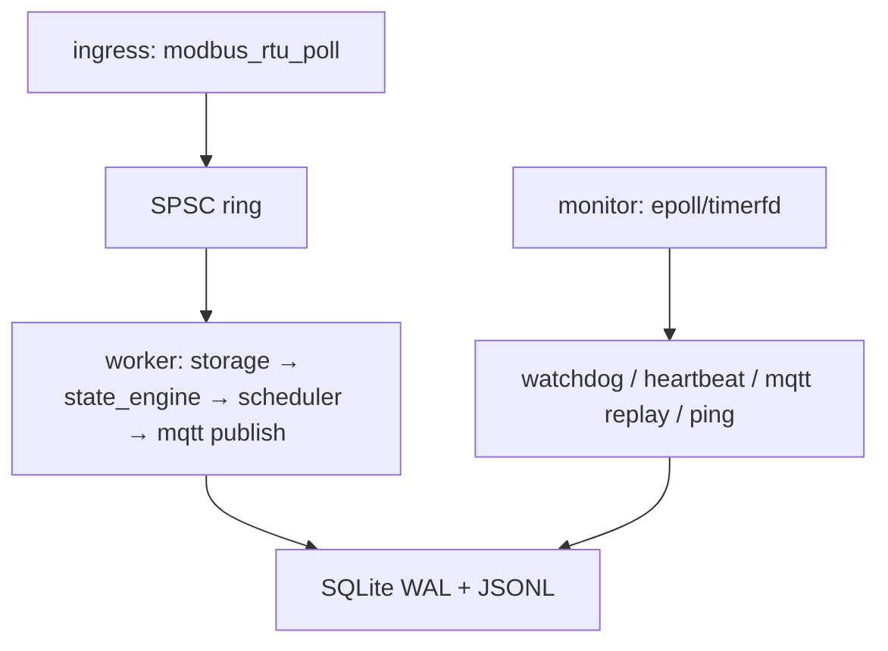

# EdgeFlow Industrial Controller

[](https://github.com/mht6426/edgeflow-energy-gateway/actions/workflows/ci.yml)

> ARM Linux 工业边缘控制平台（个人项目，文档为自用开发记录）

## 项目定位

运行在 RK3568/RK3588 ARM Linux 上的工业边缘控制器运行时，用 C11 实现一条完整闭环：

```text
插件化设备接入 → 统一设备模型 → 状态机/告警 → 削峰策略 → 指令调度
              → SQLite WAL 持久化 → MQTT 长连接上报 + 断网补传
```

EMS/储能只是内置示例场景，用于验证控制器框架能承载 BMS/PCS/Meter、Modbus、MQTT、策略计算与指令闭环；**不是真实商业 EMS**，也不实现电力系统潮流/并网算法。

## 当前真实实现状态

> 本表只列代码里**确实跑通**的能力。未实现项见 [docs/后续规划.md](docs/后续规划.md)；权威边界见 [docs/实现状态.md](docs/实现状态.md)。

### 已实现

| 能力 | 对应代码 |
| --- | --- |
| 三线程运行时（ingress / worker / monitor） | `runtime/app.c` |
| SPSC 无锁环形队列（采集与处理解耦） | `core/ring.*` |
| epoll + timerfd 周期 Reactor（单定时器） | `core/reactor.*` |
| Modbus RTU/TCP：CRC16 + libmodbus + 模拟数据 | `ingress/modbus_*` |
| 状态机 + 简单削峰（`grid_power_kw` 超阈值放电）+ 温度/SOC 告警 | `runtime/state_engine.*` |
| Command Scheduler（PENDING/SENT/ACKED/VERIFIED/FAILED，模拟回读） | `runtime/command_scheduler.*` |
| SQLite WAL + JSONL 审计 + `uploaded` 标志 + 批量补传 | `platform/storage.*` |
| 自研 MQTT 3.1.1 客户端（CONNECT/PUBLISH/PINGREQ，QoS0，含线程锁与变长 Remaining Length 编码） | `egress/mqtt_session.*` |
| Prometheus 文本 metrics / 线程心跳 / systemd watchdog(notify) / CLI | `platform/*`、`cli/main.c` |

### 尚未实现（目标架构里出现，但代码中没有，勿当成已完成能力）

- Modbus TCP adapter（已通过 libmodbus 支持，配置 `modbus_transport=tcp`）
- Thread Pool（当前是固定三线程，不是线程池）
- 分时电价(TOU)、最大需量限制、防逆流、恒功率（当前只有单一削峰规则）
- 急停/消防联锁、`DEGRADED`/`STANDBY`/`STOPPED` 完整状态转换（当前只有 `INIT`/`RUNNING`/`FAULT`）
- `upload_cursor` / `runtime_kv` 表、HTTP 上报、SIGHUP 配置热加载
- MQTT TLS / 用户名密码鉴权（当前明文 1883）

## 技术栈

| 类别 | 选型 |
| --- | --- |
| 语言 | C11 |
| 构建 | CMake ≥ 3.16 |
| 平台 | **仅 Linux**（x86_64 开发 / aarch64 板端交叉编译） |
| 并发 | pthread + C11 atomic + epoll/timerfd |
| 协议 | Modbus RTU/TCP（libmodbus）、MQTT 3.1.1（QoS0，自研最小实现） |
| 存储 | SQLite WAL + JSONL 审计 |
| 配置 | JSON（cJSON） |

## 运行时数据流

三线程模型，详见 [docs/运行时数据流.md](docs/运行时数据流.md)：



## 快速开始（Linux）

环境要求：gcc/clang、cmake ≥ 3.16、libsqlite3-dev。第三方库 cJSON、libmodbus 已 vendored 于 `third_party/`，无需单独安装。

```bash
sudo apt install -y cmake build-essential libsqlite3-dev
git clone https://github.com/mht6426/edgeflow-energy-gateway.git
cd edgeflow-energy-gateway

cmake -S . -B build
cmake --build build
ctest --test-dir build --output-on-failure

# 运行闭环
./build/edgeflow -c configs/gateway.json
# Ctrl+C 停止后查看：
tail -20 /tmp/edgeflow/edgeflow.log
cat /tmp/edgeflow/metrics.prom
./build/edgeflow-cli storage-stats --sqlite /tmp/edgeflow/edgeflow.db
```

### 交叉编译（RK3568/RK3588）

```bash
cmake -S . -B build-aarch64 -DCMAKE_TOOLCHAIN_FILE=toolchain/aarch64-linux-gnu.cmake
cmake --build build-aarch64
```

## 文档索引

完整说明见 [docs/文档索引.md](docs/文档索引.md)。核心文档：

| 文档 | 用途 |
| --- | --- |
| [实现状态.md](docs/实现状态.md) | **已实现 vs 未实现（权威边界）** |
| [架构与设计.md](docs/架构与设计.md) | 分层架构与设计取舍 |
| [运行时数据流.md](docs/运行时数据流.md) | 三线程数据流与源码对照 |
| [学习路径.md](docs/学习路径.md) | 按模块阅读顺序 |
| [开发指南.md](docs/开发指南.md) | 规范、部署、测试、长稳记录 |
| [故障排查.md](docs/故障排查.md) | 常见问题 |
| [后续规划.md](docs/后续规划.md) | 未实现能力与阶段目标 |

## 开发原则

每个模块按 `设计 → 代码（含中文注释）→ 单元测试 → 集成测试` 推进，遵守 [docs/开发指南.md](docs/开发指南.md)。

## 许可证

[MIT License](LICENSE)
