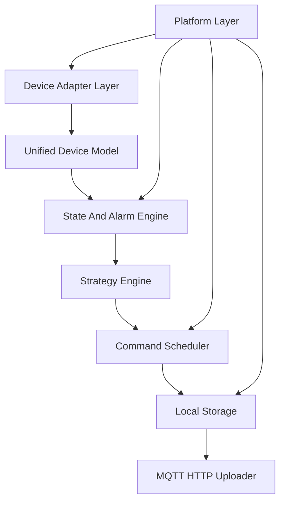

# EdgeFlow Industrial Controller

[](https://github.com/OWNER/edgeflow-energy-gateway/actions/workflows/ci.yml)

> ARM Linux 工业边缘控制平台

## 项目定位

EdgeFlow Industrial Controller 是一个运行在 RK3568/RK3588 ARM Linux 上的工业边缘控制平台。项目用于展示 Linux 系统软件能力、ARM 嵌入式 Linux 开发能力、工业设备接入能力、多线程并发设计能力、控制器软件设计能力和边缘计算能力。

项目本质不是云平台，也不是真实商业 EMS。EMS/储能只作为内置示例场景，用于验证控制器框架可以承载 BMS、PCS、Meter、Modbus、MQTT、策略计算和指令闭环。

**当前状态：早期原型（Work in Progress）**，已实现双线程采集处理闭环与基础削峰策略，完整七层架构按 [ROADMAP](docs/ROADMAP.md) 逐步演进。详见 [开发进度](docs/PROGRESS.md)（**换设备续开发先看此文档**）与 [实现状态](docs/IMPLEMENTATION_STATUS.md)。

## 适配岗位

推荐投递方向：

- Linux 系统软件工程师
- 工业边缘计算工程师
- 工业网关开发工程师
- 能源 IoT 边缘设备工程师
- 储能 EMS 软件工程师（初中级）
- 充电桩控制器软件工程师
- 工业控制器开发工程师

谨慎投递方向：

- 强依赖多年真实 BMS/PCS 控制算法经验的高级岗位
- 电力系统潮流分析、并网控制算法岗位
- 纯云平台、微服务或 Web 前端岗位
- 纯 MCU/驱动/BSP 岗位

## 技术栈

| 类别 | 选型 |
| --- | --- |
| 语言 | C11（规划 C++17） |
| 构建 | CMake |
| 平台 | Linux（开发/部署），支持 aarch64 交叉编译 |
| 并发 | 双线程 + SPSC 队列（规划 epoll/Reactor + Thread Pool） |
| 协议 | Modbus RTU（模拟）、MQTT 3.1.1 |
| 存储 | JSONL 本地缓存（规划 SQLite WAL） |
| 配置 | JSON |

## 当前实现状态

| 能力 | 状态 |
| --- | --- |
| 统一设备模型类型 | ✅ |
| Modbus RTU 模拟采集 + CRC | ✅ |
| 双线程运行时 + SPSC 队列 | ✅ |
| 基础状态机 + 温度告警 | ✅ |
| 削峰填谷策略（可配置阈值） | ✅ 原型 |
| JSONL 缓存 + metrics + 日志 | ✅ |
| MQTT 上报（CONNACK 校验） | ✅ 基础 |
| Command Scheduler / SQLite / epoll | ⏳ 规划中 |
| 真实串口 Modbus / 断网补传 / CLI | ⏳ 规划中 |

完整对照见 [docs/IMPLEMENTATION_STATUS.md](docs/IMPLEMENTATION_STATUS.md)。

## 核心架构（目标）



## 快速开始

**环境要求：** Linux（Ubuntu/Debian 推荐），gcc/clang，cmake ≥ 3.16。Windows 无法原生编译（依赖 POSIX socket/pthread）。

```bash
git clone https://github.com/OWNER/edgeflow-energy-gateway.git
cd edgeflow-energy-gateway

cmake -S . -B build
cmake --build build
ctest --test-dir build --output-on-failure

# 运行（无需 MQTT broker 也可启动，上报失败会记入 metrics）
./build/edgeflow -c configs/gateway.json
```

开发配置使用 `/tmp/edgeflow` 路径；板端部署见 `configs/gateway.prod.json` 与 [DEPLOY.md](docs/DEPLOY.md)。

### 交叉编译（RK3568/RK3588）

```bash
cmake -S . -B build-aarch64 -DCMAKE_TOOLCHAIN_FILE=toolchain/aarch64-linux-gnu.cmake
cmake --build build-aarch64
```

## 文档索引

```text
docs/
├── PROGRESS.md               # 开发进度总览（换设备续开发先看）
├── IMPLEMENTATION_STATUS.md  # 已实现 vs 规划中（发布前必读）
├── PROJECT_SPEC.md           # 项目定位与硬约束
├── ARCHITECTURE.md           # 七层核心架构
├── DEVICE_MODEL.md           # Device/Point/Alarm/Command/Telemetry 模型
├── MODULE_DESIGN.md          # 模块职责、输入输出、线程模型、异常处理
├── MARKET_REQUIREMENTS.md    # 市场需求和示例场景映射
├── ROADMAP.md                # 三个月交付路线和验收标准
├── HARDWARE_SELECTION.md     # RK3568/RK3588 工控板选型
├── DEPLOY.md                 # 板端部署说明
├── TEST_PLAN.md              # 模块级测试矩阵
├── TROUBLESHOOTING.md        # 故障闭环
├── INTERVIEW_NOTES.md        # 面试导向设计说明
└── RESUME_SNIPPETS.md        # 简历表达
```

## 开发原则

每个模块按以下顺序推进：

```text
设计 -> 代码 -> 单元测试 -> 集成测试
```

## 许可证

[MIT License](LICENSE)

## 简历一句话

基于 RK3568/RK3588 ARM Linux 设计并实现工业边缘控制平台原型，支持插件化工业设备接入设计、统一设备模型、状态机告警联锁、削峰填谷策略、JSONL 本地缓存、MQTT 上报、SPSC 双线程运行时、Prometheus metrics 和 systemd 部署；以内置 BMS/PCS/Meter 模拟器验证控制闭环（完整指令调度与 SQLite WAL 按路线图推进中）。
