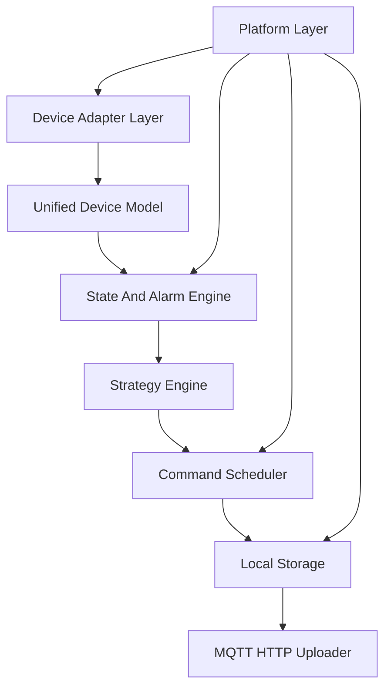

# EdgeFlow Industrial Controller

[](https://github.com/mht6426/edgeflow-energy-gateway/actions/workflows/ci.yml)

> ARM Linux 工业边缘控制平台

## 项目定位

EdgeFlow Industrial Controller 是一个运行在 RK3568/RK3588 ARM Linux 上的工业边缘控制平台。项目用于展示 Linux 系统软件能力、ARM 嵌入式 Linux 开发能力、工业设备接入能力、多线程并发设计能力、控制器软件设计能力和边缘计算能力。

项目本质不是云平台，也不是真实商业 EMS。EMS/储能只作为内置示例场景，用于验证控制器框架可以承载 BMS、PCS、Meter、Modbus、MQTT、策略计算和指令闭环。

**当前状态：边学边做（Learning Path）**。工程已按 [LEARNING_PATH.md](docs/LEARNING_PATH.md) 重构，**从 M1 统一设备模型开始**，逐步添加 Config、Adapter、状态机、调度器、运行时等模块。详见 [开发进度](docs/PROGRESS.md) 与 [实现状态](docs/IMPLEMENTATION_STATUS.md)。

## 适配岗位

推荐投递方向：

- Linux 系统软件工程师
- 工业边缘计算工程师
- 工业网关开发工程师
- 能源 IoT 边缘设备工程师
- 储能 EMS 软件工程师（初中级）
- 充电桩控制器软件工程师
- 工业控制器开发工程师

谨慎投递方向：

- 强依赖多年真实 BMS/PCS 控制算法经验的高级岗位
- 电力系统潮流分析、并网控制算法岗位
- 纯云平台、微服务或 Web 前端岗位
- 纯 MCU/驱动/BSP 岗位

## 技术栈

| 类别 | 选型 |
| --- | --- |
| 语言 | C11（规划 C++17） |
| 构建 | CMake |
| 平台 | **Linux**（默认；x86_64 开发 / aarch64 板端）；Windows 仅通过 WSL |
| 并发 | 按学习路径逐步引入（目标 epoll/Reactor + Thread Pool） |
| 协议 | 按学习路径逐步引入（Modbus、MQTT） |
| 存储 | 规划 SQLite WAL |
| 配置 | JSON（M2 实现） |

## 当前实现状态（M3）

| 能力 | 状态 |
| --- | --- |
| 统一设备模型（M1） | ✅ |
| Config + Logger（M2） | ✅ |
| Adapter 插件 + stub 采集（M3） | 🔄 |
| Modbus RTU（M4） | ⏳ 下一步 |
| Device Adapter（M3-M4） | ⏳ |
| 状态机 / Command Scheduler（M5-M6） | ⏳ |
| 运行时 / MQTT / CLI 等（M7-M10） | ⏳ |

完整学习步骤见 [docs/LEARNING_PATH.md](docs/LEARNING_PATH.md)，实现边界见 [docs/IMPLEMENTATION_STATUS.md](docs/IMPLEMENTATION_STATUS.md)。

## 核心架构（目标）



## 快速开始

**默认执行环境：Linux**（Ubuntu/Debian 推荐）。本工程使用 POSIX API，**不在源码中兼容 Windows**。在 Windows 上请使用 [WSL2](https://learn.microsoft.com/zh-cn/windows/wsl/)：

```powershell
# Windows PowerShell：进入 WSL 后按 Linux 步骤操作
wsl
```

**环境要求：** gcc/clang，cmake ≥ 3.16。

```bash
git clone https://github.com/mht6426/edgeflow-energy-gateway.git
cd edgeflow-energy-gateway

cmake -S . -B build
cmake --build build
ctest --test-dir build --output-on-failure

# M2：加载配置并写日志
./build/edgeflow -c configs/gateway.json
tail -f /tmp/edgeflow/edgeflow.log
```

配置文件 `configs/gateway.json` 在 **M2** 启用；板端部署见 [DEPLOY.md](docs/DEPLOY.md)（需完成更多学习步骤后）。

### 交叉编译（RK3568/RK3588）

```bash
cmake -S . -B build-aarch64 -DCMAKE_TOOLCHAIN_FILE=toolchain/aarch64-linux-gnu.cmake
cmake --build build-aarch64
```

## 文档索引

```text
docs/
├── CODE_STYLE.md             # ★ Linux 默认环境 + 注释规范（写代码前必读）
├── LEARNING_PATH.md          # ★ 边学边做主路径（开发第一件事）
├── PROGRESS.md               # 开发进度总览
├── IMPLEMENTATION_STATUS.md  # 已实现 vs 规划中
├── PROJECT_SPEC.md           # 项目定位与硬约束
├── ARCHITECTURE.md           # 七层核心架构
├── DEVICE_MODEL.md           # Device/Point/Alarm/Command/Telemetry 模型
├── MODULE_DESIGN.md          # 模块职责、输入输出、线程模型、异常处理
├── MARKET_REQUIREMENTS.md    # 市场需求和示例场景映射
├── ROADMAP.md                # 三个月交付路线和验收标准
├── HARDWARE_SELECTION.md     # RK3568/RK3588 工控板选型
├── DEPLOY.md                 # 板端部署说明
├── TEST_PLAN.md              # 模块级测试矩阵
├── TROUBLESHOOTING.md        # 故障闭环
├── INTERVIEW_NOTES.md        # 面试导向设计说明
└── RESUME_SNIPPETS.md        # 简历表达
```

## 开发原则

每个模块按以下顺序推进，并遵守 [CODE_STYLE.md](docs/CODE_STYLE.md)：

```text
设计 -> 代码（含详细中文注释）-> 单元测试 -> 集成测试
```

## 许可证

[MIT License](LICENSE)

## 简历一句话

基于 RK3568/RK3588 ARM Linux 按模块化学习路径构建工业边缘控制平台，当前完成统一设备模型层；后续逐步实现设备接入、状态机告警、指令调度、运行时与 MQTT 上报（详见 LEARNING_PATH.md）。
