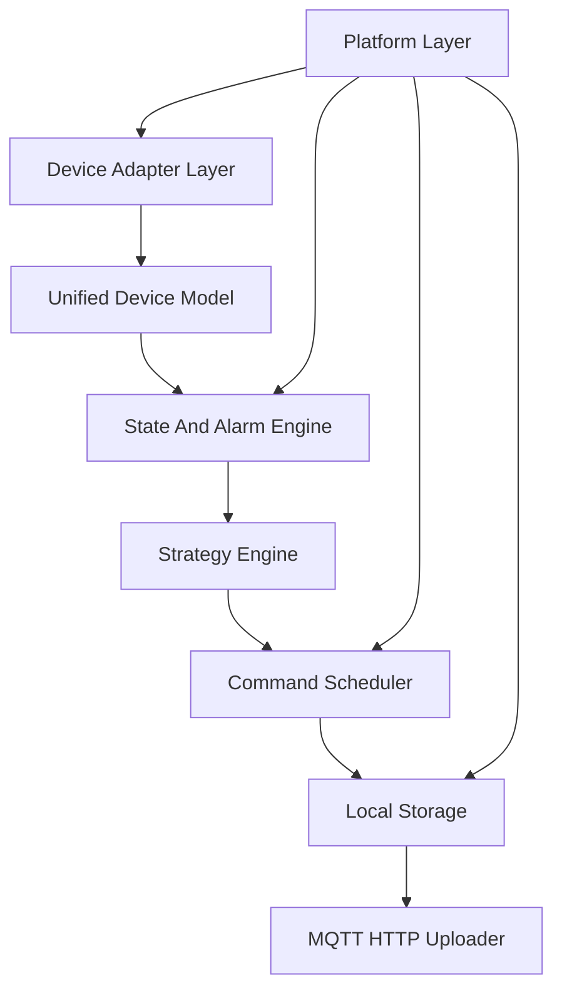

# EdgeFlow Industrial Controller 架构设计

## 设计目标

EdgeFlow Industrial Controller 的目标是交付一个运行在 RK3568/RK3588 ARM Linux 上的工业边缘控制平台。项目重点是 Linux 系统软件、工业设备接入、多线程控制器运行时、可靠指令调度、本地存储、可观测和板端部署能力。

EMS/储能不是项目本质，而是内置示例场景。项目通过 BMS/PCS/Meter 模拟器验证控制器框架可以承载分时电价、削峰填谷、最大需量限制和恒功率控制闭环。

## 核心链路



## 分层职责

```text
Device Adapter Layer
  Modbus RTU / Modbus TCP / TCP / UDP / MQTT client side / device simulator

Unified Device Model
  Device / Point / Alarm / Command / Telemetry

State And Alarm Engine
  state machine / online offline / alarm transition / interlock

Strategy Engine
  TOU tariff / peak shaving / demand limit / constant power

Command Scheduler
  command queue / timeout / retry / readback verify / audit

Local Storage
  SQLite WAL / offline cache / upload cursor / cleanup

MQTT HTTP Uploader
  MQTT publish / HTTP optional / batch upload / offline replay

Platform Layer
  Config Manager / Logger / Metrics / Watchdog / CLI / Thread Heartbeat / systemd
```

## 并发模型

系统采用 Reactor + Thread Pool 的组合：

- `main`：加载配置、初始化模块、处理 signal、协调优雅退出。
- `reactor`：基于 epoll 管理 TCP、UDP、MQTT socket 和 timerfd，避免每个连接一个线程。
- `adapter_worker`：执行 Modbus RTU 阻塞串口轮询、Modbus TCP 请求和设备模拟。
- `state_worker`：消费 telemetry，运行状态机和告警联锁。
- `strategy_worker`：根据设备状态和配置策略生成 `Command`。
- `command_worker`：负责指令下发、超时、重试和回读校验。
- `storage_worker`：写 SQLite WAL，处理断网缓存和补传游标。
- `platform_monitor`：刷新 metrics、thread heartbeat、watchdog 和资源指标。

设计原则：

- 通信层只做协议收发和基础解析，不包含业务策略。
- 业务层只访问统一设备模型，不直接访问协议原始数据。
- 状态机与策略引擎解耦，告警联锁优先级高于业务策略。
- 控制命令必须进入 `Command Scheduler`，禁止策略模块直接写设备。
- 上报失败不能阻塞设备采集、状态机和命令调度。

## Device Adapter Layer

职责：

- 插件化接入 Modbus RTU、Modbus TCP、TCP、UDP、模拟 BMS、模拟 PCS、模拟 Meter。
- 将协议数据转换为统一 `Telemetry` 或 `Point`。
- 将 `Command` 转换为具体协议写操作。

输入：

- JSON 配置。
- 设备 profile。
- Reactor 事件或轮询定时器。
- Command Scheduler 下发的命令。

输出：

- `Telemetry`。
- `AdapterStatus`。
- `CommandResult`。

异常处理：

- 串口打开失败。
- CRC 错误。
- Modbus 异常码。
- TCP 断连。
- 设备超时。
- 配置中的寄存器地址或 scale 错误。

## Unified Device Model

统一模型：

- `Device`：设备身份、协议类型、在线状态、最近错误。
- `Point`：测点定义、单位、scale、质量位。
- `Telemetry`：采集值、时间戳、质量、来源。
- `Alarm`：告警码、等级、恢复状态。
- `Command`：命令 ID、目标设备、状态、重试次数。

价值：

- 新协议接入不影响状态机和策略引擎。
- 业务层不依赖 Modbus 寄存器、MQTT topic 或 TCP frame。
- 单元测试可以直接构造模型对象，不依赖真实设备。

## State And Alarm Engine

职责：

- 设备在线/离线判断。
- SOC 越界、温度告警、通信故障、急停联锁。
- 告警产生、恢复和去抖。
- 系统状态转换。

状态机示例：

```text
INIT -> STANDBY -> RUNNING -> DEGRADED
                  -> FAULT -> STOPPED
```

异常处理：

- 设备长时间无 telemetry：进入离线。
- 关键设备离线：进入 `DEGRADED` 或 `FAULT`。
- 急停：立即进入 `STOPPED`。
- 告警恢复：必须满足恢复条件和恢复时间窗。

## Strategy Engine

职责：

- 分时电价。
- 削峰填谷。
- 最大需量限制。
- 恒功率充放电。

边界：

- 不实现复杂电力算法。
- 不实现潮流计算。
- 不实现并网控制。
- 不直接操作设备。

输出：

- `StrategyDecision`。
- `Command`。
- 策略解释文本，便于日志和面试说明。

## Command Scheduler

职责：

- 接收策略引擎生成的 `Command`。
- 分配 command_id。
- 按目标设备串行或限并发下发。
- 处理超时、重试、回读校验。
- 写入审计日志。

命令状态：

```text
PENDING -> SENT -> ACKED -> VERIFIED
                 -> TIMEOUT -> RETRYING
                 -> FAILED
```

可靠性要求：

- 每条命令状态可追踪。
- 命令失败必须生成 `Alarm` 或 `CommandResult`。
- 重试次数和超时时间必须可配置。
- 回读校验失败不能被误判为成功。

## Local Storage

采用 SQLite WAL。

表设计：

- `telemetry`：遥测数据。
- `alarms`：告警产生和恢复。
- `commands`：命令审计。
- `upload_cursor`：补传游标。
- `runtime_kv`：最近状态和版本信息。

为什么使用 WAL：

- 读写并发更适合边缘设备。
- 断电后恢复能力优于普通文件追加。
- 可以控制事务边界，避免命令审计和告警丢失。

## MQTT HTTP Uploader

职责：

- 批量上报 telemetry、alarm、command_result、heartbeat 和 metrics。
- 网络不可达时只增加缓存积压。
- 网络恢复后按 `upload_cursor` 补传。

首版以 MQTT 为主，HTTP 作为接口预留，不实现 Web 前端。

## Platform Layer

必须包含：

- Config Manager：JSON 配置加载、校验、SIGHUP reload。
- Logger：轻量结构化日志。
- Metrics：Prometheus text format。
- Watchdog：systemd watchdog 或软件 watchdog。
- CLI：status、devices、alarms、commands、cache-stat、validate-config。
- Thread Heartbeat：检测线程卡死。
- systemd：开机自启、崩溃重启、资源限制。

## 资源释放

退出路径由 `SIGINT` / `SIGTERM` 触发。所有线程进入 shutdown 流程。串口 fd、socket、SQLite handle、日志文件、队列对象、命令对象和 Adapter 上下文必须由对应模块统一释放，避免 fd 泄漏、脏数据未落盘和命令状态丢失。
