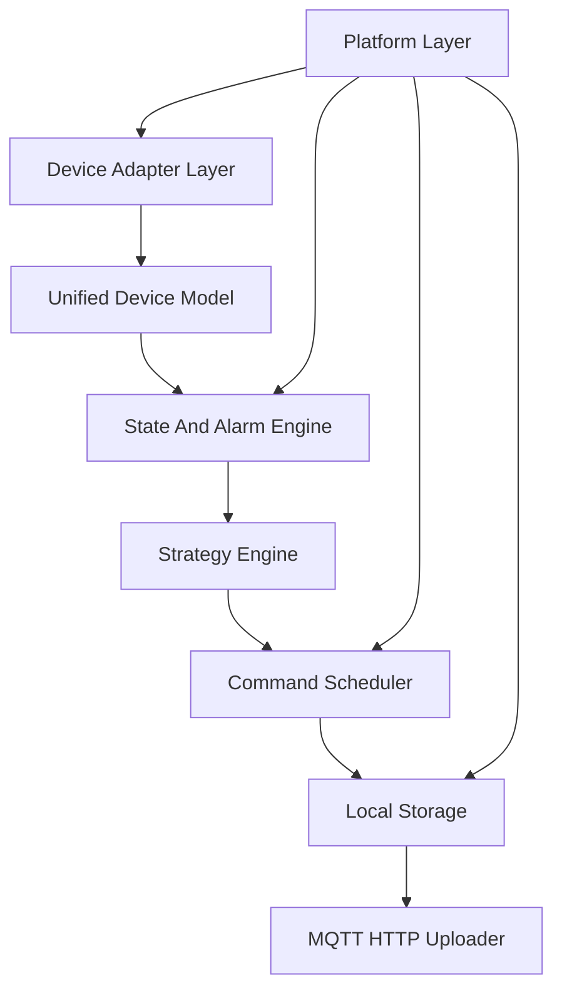

# EdgeFlow Industrial Controller 架构设计

> **重要**：本文描述的是**目标架构**，包含尚未实现的分层与能力。代码的**真实实现边界**以 [IMPLEMENTATION_STATUS.md](IMPLEMENTATION_STATUS.md) 为准。文中标注 `（目标，未实现）` 的部分请勿当作已完成能力。

## 设计目标

EdgeFlow Industrial Controller 的目标是交付一个运行在 RK3568/RK3588 ARM Linux 上的工业边缘控制平台。项目重点是 Linux 系统软件、工业设备接入、多线程控制器运行时、可靠指令调度、本地存储、可观测和板端部署能力。

EMS/储能不是项目本质，而是内置示例场景。当前用 Modbus 模拟点位验证了"采集→状态机/削峰→指令→落盘→上报/补传"的闭环；分时电价、需量限制、恒功率等只是该框架后续可承载的示例策略方向，非已实现能力。

## 核心链路



## 分层职责

```text
Device Adapter Layer
  Modbus RTU / Modbus TCP / TCP / UDP / MQTT client side / device simulator

Unified Device Model
  Device / Point / Alarm / Command / Telemetry

State And Alarm Engine
  state machine / online offline / alarm transition / interlock

Strategy Engine
  TOU tariff / peak shaving / demand limit / constant power

Command Scheduler
  command queue / timeout / retry / readback verify / audit

Local Storage
  SQLite WAL / offline cache / upload cursor / cleanup

MQTT HTTP Uploader
  MQTT publish / HTTP optional / batch upload / offline replay

Platform Layer
  Config Manager / Logger / Metrics / Watchdog / CLI / Thread Heartbeat / systemd
```

## 并发模型

### 已实现：固定三线程 + SPSC + 单定时器 Reactor

当前代码采用三个固定线程（非线程池），通过一个 SPSC 无锁队列解耦采集与处理：

- `main`：加载配置、初始化模块、处理 `SIGINT/SIGTERM/SIGHUP`、协调优雅退出。
- `ingress_thread`：周期 `poll` Modbus（模拟/串口），结果 `push` 进 SPSC ring。
- `worker_thread`：`pop` → SQLite/JSONL 落盘 → 状态机/策略 → 指令调度 → MQTT 实时上报。
- `monitor_thread`：epoll + timerfd 周期触发 watchdog 喂狗、心跳检查、MQTT 断网补传与 PING。

### 目标（未实现）：Reactor + Thread Pool 细分 worker

下列按职责细分的多 worker（`state_worker` / `strategy_worker` / `command_worker` / `storage_worker` 等）与线程池、多 fd Reactor 为**规划方向，当前未实现**：

- `reactor`：基于 epoll 统一管理 TCP/UDP/MQTT 多个 socket 与 timerfd（当前 Reactor 仅承载单个 timerfd）。
- 各业务 worker 拆分到线程池，避免阻塞式串口轮询与 SQLite 写入互相影响。

设计原则：

- 通信层只做协议收发和基础解析，不包含业务策略。
- 业务层只访问统一设备模型，不直接访问协议原始数据。
- 状态机与策略引擎解耦，告警联锁优先级高于业务策略。
- 控制命令必须进入 `Command Scheduler`，禁止策略模块直接写设备。
- 上报失败不能阻塞设备采集、状态机和命令调度。

## Device Adapter Layer

职责：

- 插件化接入 Modbus RTU、Modbus TCP、TCP、UDP、模拟 BMS、模拟 PCS、模拟 Meter。
- 将协议数据转换为统一 `Telemetry` 或 `Point`。
- 将 `Command` 转换为具体协议写操作。

> 当前仅实现 Modbus RTU（CRC16 + 模拟数据 + termios 串口）一条插件；Modbus TCP、TCP、UDP 为目标，未实现。

输入：

- JSON 配置。
- 设备 profile。
- Reactor 事件或轮询定时器。
- Command Scheduler 下发的命令。

输出：

- `Telemetry`。
- `AdapterStatus`。
- `CommandResult`。

异常处理：

- 串口打开失败。
- CRC 错误。
- Modbus 异常码。
- TCP 断连。
- 设备超时。
- 配置中的寄存器地址或 scale 错误。

## Unified Device Model

统一模型：

- `Device`：设备身份、协议类型、在线状态、最近错误。
- `Point`：测点定义、单位、scale、质量位。
- `Telemetry`：采集值、时间戳、质量、来源。
- `Alarm`：告警码、等级、恢复状态。
- `Command`：命令 ID、目标设备、状态、重试次数。

价值：

- 新协议接入不影响状态机和策略引擎。
- 业务层不依赖 Modbus 寄存器、MQTT topic 或 TCP frame。
- 单元测试可以直接构造模型对象，不依赖真实设备。

## State And Alarm Engine

职责：

- 设备在线/离线判断。
- SOC 越界、温度告警、通信故障、急停联锁。
- 告警产生、恢复和去抖。
- 系统状态转换。

状态机示例：

```text
INIT -> STANDBY -> RUNNING -> DEGRADED
                  -> FAULT -> STOPPED
```

> 当前实现仅 `INIT`/`RUNNING`/`FAULT` 三态，以及温度高、SOC 低两类告警；`STANDBY`/`DEGRADED`/`STOPPED`、急停/消防联锁、告警去抖与恢复时间窗为目标，未实现。

异常处理：

- 设备长时间无 telemetry：进入离线。
- 关键设备离线：进入 `DEGRADED` 或 `FAULT`。
- 急停：立即进入 `STOPPED`。
- 告警恢复：必须满足恢复条件和恢复时间窗。

## Strategy Engine

职责：

- 分时电价。
- 削峰填谷。
- 最大需量限制。
- 恒功率充放电。

边界：

- 不实现复杂电力算法。
- 不实现潮流计算。
- 不实现并网控制。
- 不直接操作设备。

输出：

- `StrategyDecision`。
- `Command`。
- 策略解释文本，便于日志和问题定位。

> 当前实现仅有单一削峰规则（`grid_power_kw` 超阈值时生成放电 `Command`），分时电价、需量限制、防逆流、恒功率均为目标，未实现。

## Command Scheduler

职责：

- 接收策略引擎生成的 `Command`。
- 分配 command_id。
- 按目标设备串行或限并发下发。
- 处理超时、重试、回读校验。
- 写入审计日志。

命令状态：

```text
PENDING -> SENT -> ACKED -> VERIFIED
                 -> TIMEOUT -> RETRYING
                 -> FAILED
```

> 当前实现：提交即同步下发，写成功后模拟回读判 `VERIFIED`，写失败判 `FAILED`，并写命令审计；`TIMEOUT`/`RETRYING`、按设备限并发、可配置重试次数为目标，未实现。

可靠性要求：

- 每条命令状态可追踪。
- 命令失败必须生成 `Alarm` 或 `CommandResult`。
- 重试次数和超时时间必须可配置。
- 回读校验失败不能被误判为成功。

## Local Storage

采用 SQLite WAL。

表设计（已实现 `telemetry`/`alarms`/`commands`；`upload_cursor`/`runtime_kv` 为目标，未实现）：

- `telemetry`：遥测数据，含 `uploaded` 标志位用于断网补传（已实现）。
- `alarms`：告警产生和恢复（已实现）。
- `commands`：命令审计（已实现）。
- `upload_cursor`：补传游标（目标，未实现，当前用 `uploaded` 标志替代）。
- `runtime_kv`：最近状态和版本信息（目标，未实现）。

为什么使用 WAL：

- 读写并发更适合边缘设备。
- 断电后恢复能力优于普通文件追加。
- 可以控制事务边界，避免命令审计和告警丢失。

## MQTT HTTP Uploader

职责：

- 批量上报 telemetry、alarm、command_result、heartbeat 和 metrics。
- 网络不可达时只增加缓存积压。
- 网络恢复后按 `upload_cursor` 补传。

首版以 MQTT 为主，HTTP 作为接口预留，不实现 Web 前端。

> 当前实现：自研 MQTT 3.1.1 最小客户端（CONNECT/PUBLISH/PINGREQ，QoS0，明文 1883），worker 实时 publish telemetry，monitor 周期补传 `uploaded=0` 的历史数据；批量打包、HTTP 上报、TLS/鉴权为目标，未实现。

## Platform Layer

必须包含：

- Config Manager：JSON 配置加载（已实现）；schema 校验、SIGHUP reload（目标，未实现）。
- Logger：轻量结构化日志（已实现）。
- Metrics：Prometheus text format（已实现）。
- Watchdog：systemd watchdog `Type=notify`（已实现）。
- CLI：`validate-config`、`status`、`storage-stats`（已实现）；`devices`/`alarms`/`commands`/`cache-stat`（目标，未实现）。
- Thread Heartbeat：检测线程卡死（已实现）。
- systemd：开机自启、崩溃重启（已实现，见 `deploy/systemd/edgeflow.service`）。

## 资源释放

退出路径由 `SIGINT` / `SIGTERM` 触发。所有线程进入 shutdown 流程。串口 fd、socket、SQLite handle、日志文件、队列对象、命令对象和 Adapter 上下文必须由对应模块统一释放，避免 fd 泄漏、脏数据未落盘和命令状态丢失。
