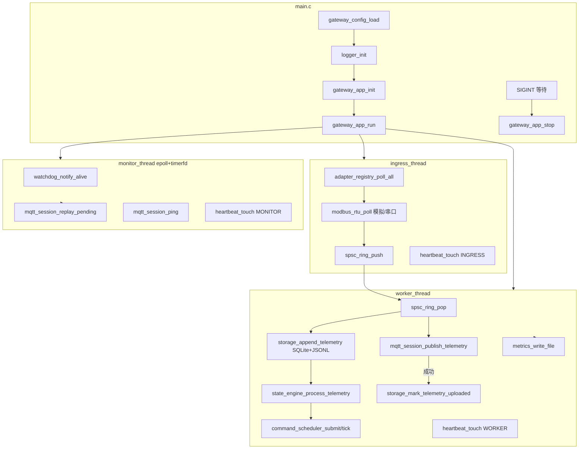

# EdgeFlow 运行时数据流（进阶版）

> 三线程 + SQLite WAL + MQTT 长连接补传，便于对照源码阅读。

## 总览



## 源码对照表

| 步骤 | 文件 |
|------|------|
| 入口 / 信号 | `src/main.c` |
| 配置 | `src/platform/config.c` |
| 日志 | `src/platform/logger.c` |
| 运行时编排 | `src/runtime/app.c` |
| epoll reactor | `src/core/reactor.c` |
| 插件注册表 | `src/ingress/adapter.c` |
| Modbus 采集 | `src/ingress/modbus_rtu.c` |
| 串口 termios | `src/ingress/modbus_serial.c` |
| Modbus 插件 | `src/ingress/modbus_adapter.c` |
| SPSC 队列 | `src/core/ring.c` |
| 状态机 / 策略 | `src/runtime/state_engine.c` |
| 指令调度 | `src/runtime/command_scheduler.c` |
| SQLite + JSONL | `src/platform/storage.c` |
| MQTT 长连接 | `src/egress/mqtt_session.c` |
| Watchdog | `src/platform/watchdog.c` |
| 心跳 | `src/platform/heartbeat.c` |
| 指标 | `src/platform/metrics.c` |
| CLI | `src/cli/main.c` |
| 统一模型 | `src/model/device_model.*` |

## 运行与查看成果

```bash
cmake -S . -B build && cmake --build build
ctest --test-dir build --output-on-failure

./build/edgeflow -c configs/gateway.json
# Ctrl+C 停止

./build/edgeflow-cli status --metrics /tmp/edgeflow/metrics.prom
./build/edgeflow-cli storage-stats --sqlite /tmp/edgeflow/edgeflow.db

tail -f /tmp/edgeflow/edgeflow.log
cat /tmp/edgeflow/metrics.prom
sqlite3 /tmp/edgeflow/edgeflow.db "SELECT id,point_id,value,uploaded FROM telemetry LIMIT 5;"
```

## 进阶配置项（gateway.json）

| 字段 | 说明 |
|------|------|
| `use_sqlite` | 启用 SQLite WAL 主存储 |
| `sqlite_path` | 数据库路径 |
| `mqtt_replay_batch` | monitor 每轮补传条数上限 |
| `mqtt_keepalive_sec` | MQTT CONNECT keepalive |
| `watchdog_interval_ms` | monitor 周期 / systemd WATCHDOG=1 间隔 |
| `heartbeat_interval_ms` | 线程 stale 判定基准 |
| `mqtt_heartbeat_topic` | 网关存活 MQTT 主题 |

## systemd

`deploy/systemd/edgeflow.service` 使用 `Type=notify` + `WatchdogSec=10`。进程启动后 `watchdog_notify_ready()`，monitor 线程周期性 `watchdog_notify_alive()`。

## 预期现象

- 日志：`edgeflow running (advanced)`、alarm、command VERIFIED
- metrics：`edgeflow_storage_pending_count`、`edgeflow_mqtt_replay_total`、心跳 age
- broker 断开时：实时 publish 失败，SQLite `uploaded=0` 累积；broker 恢复后 monitor 补传
