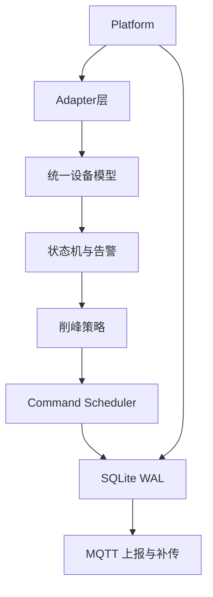

# 架构与设计

> 描述**当前已实现架构**与关键取舍。未实现能力见 [后续规划.md](后续规划.md)。

## 分层与数据流

| 层 | 职责 | 主要代码 |
| --- | --- | --- |
| Adapter | 协议收发、转 `telemetry_t` / 写命令 | `ingress/modbus_*` |
| Device Model | 五类统一对象，业务与协议解耦 | `model/device_model.*` |
| Runtime | 三线程编排、队列、状态机、调度 | `runtime/app.c` 等 |
| Storage | 本地持久化、补传标志 | `platform/storage.*` |
| Egress | MQTT 实时上报与补传 | `egress/mqtt_session.*` |
| Platform | 配置、日志、metrics、watchdog | `platform/*` |

## 统一设备模型（五类对象）

| 类型 | 作用 |
| --- | --- |
| `device_t` | 设备身份、协议、在线状态 |
| `point_t` | 测点定义（单位、scale） |
| `telemetry_t` | 一次采集结果（值 + 时间戳 + 质量位） |
| `alarm_event_t` | 告警事件 |
| `command_t` | 控制指令及状态机 |

业务层（`state_engine`、`command_scheduler`）**禁止**直接访问 Modbus 寄存器或串口 fd。

## 并发模型

- **ingress_thread**：周期 `poll`，结果 `push` 进 SPSC ring
- **worker_thread**：`pop` → 落库 → 状态机/策略 → 调度 → MQTT 实时上报
- **monitor_thread**：epoll/timerfd → watchdog、心跳检查、MQTT 补传与 PING

设计原则：通信层不含业务策略；策略不直接写设备，命令必经 Scheduler；上报失败不阻塞采集。

## 关键设计取舍

### Adapter 与业务解耦 [已实现]

Adapter 只输出 `telemetry_t`。新增 Modbus TCP 或后续协议时，业务层无需改动。

### SQLite WAL [已实现]

边缘侧需并发写 telemetry/告警/命令审计，并在断网后读 `uploaded=0` 补传。WAL 比纯追加文件更适合读写并发。

### 断网本地自治 [已实现]

broker 不可达时：采集、状态机、策略、调度继续；数据写入 SQLite；monitor 恢复后批量补传。

### MQTT 双线程加锁 [已实现]

worker 与 monitor 共享 socket，`pthread_mutex` 保护写操作；补传前先查 DB 再进锁，缩短临界区。

### libmodbus + 自研 CRC [已实现]

真实 RTU/TCP 走 libmodbus；`modbus_crc16` 保留用于单测与协议理解展示，不重复维护完整协议栈。

### 未采用 Thread Pool [目标]

当前固定三线程已满足 Demo/验证规模；线程池、多 fd Reactor 列为后续规划，避免过度设计。

## 项目边界（不是什么）

- **不是**商业 EMS，不做潮流/并网/电力市场算法
- **不是**完整虚拟电厂平台，只做边缘终端运行时验证
- 储能/削峰仅为**示例场景**，用于验证框架可承载 BMS/PCS/Meter 接入
