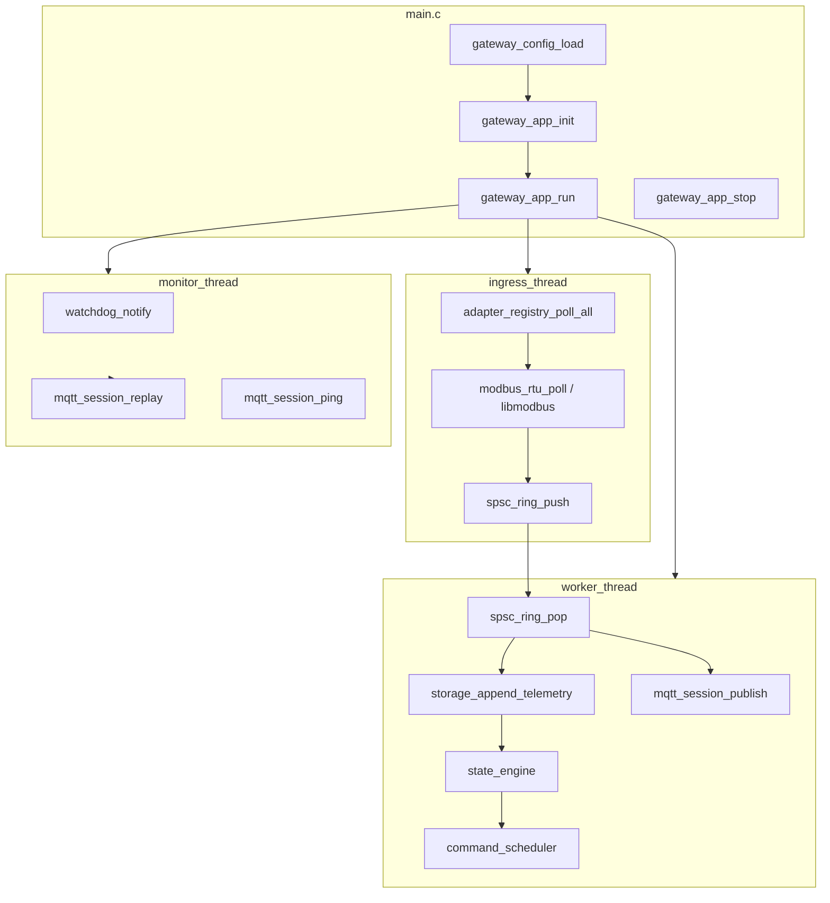

# 运行时数据流

> 三线程 + SQLite WAL + MQTT 长连接补传，便于对照源码阅读。

## 总览



## 源码对照

| 步骤 | 文件 |
| --- | --- |
| 入口 / 信号 | `src/main.c` |
| 配置（cJSON） | `src/platform/config.c` |
| 运行时编排 | `src/runtime/app.c` |
| SPSC 队列 | `src/core/ring.c` |
| Reactor | `src/core/reactor.c` |
| Modbus 插件 | `src/ingress/modbus_adapter.c` |
| 模拟 / CRC | `src/ingress/modbus_rtu.c` |
| libmodbus 后端 | `src/ingress/modbus_libmodbus.c` |
| 状态机 / 策略 | `src/runtime/state_engine.c` |
| 指令调度 | `src/runtime/command_scheduler.c` |
| 存储 | `src/platform/storage.c` |
| MQTT | `src/egress/mqtt_session.c` |
| metrics / watchdog / heartbeat | `src/platform/metrics.c` 等 |

## 本地验证

```bash
cmake -S . -B build && cmake --build build
ctest --test-dir build --output-on-failure

./build/edgeflow -c configs/gateway.json
# Ctrl+C 停止后：

./build/edgeflow-cli status --metrics /tmp/edgeflow/metrics.prom
./build/edgeflow-cli storage-stats --sqlite /tmp/edgeflow/edgeflow.db
tail -20 /tmp/edgeflow/edgeflow.log
```

## 关键配置项

| 字段 | 说明 |
| --- | --- |
| `simulate` | `true` 走内置模拟器，不打开真实设备 |
| `modbus_transport` | `rtu` 或 `tcp`（libmodbus） |
| `use_sqlite` / `sqlite_path` | WAL 主存储 |
| `mqtt_replay_batch` | monitor 每轮补传上限 |
| `watchdog_interval_ms` | monitor 周期与 systemd 喂狗间隔 |

## 预期现象

- 日志：startup、alarm、command VERIFIED
- metrics：`edgeflow_storage_pending_count`、`edgeflow_mqtt_replay_total`、心跳 age
- broker 断开：publish 失败计数增长，`uploaded=0` 累积；恢复后 monitor 补传

## systemd

`deploy/systemd/edgeflow.service` 使用 `Type=notify` + `WatchdogSec=10`。详见 [开发指南.md](开发指南.md)。
